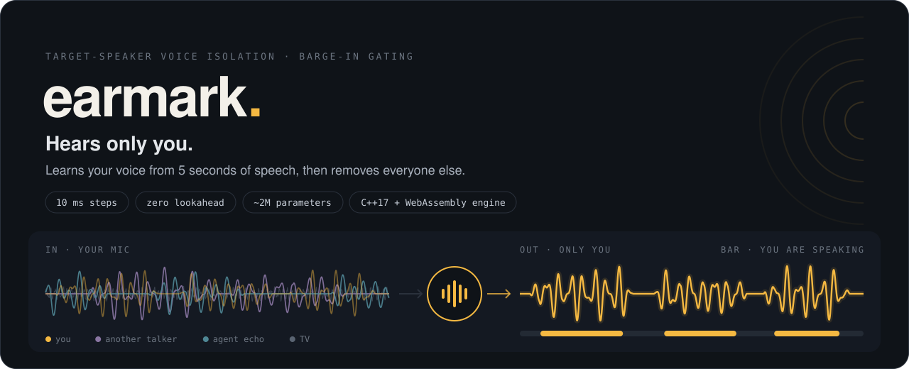
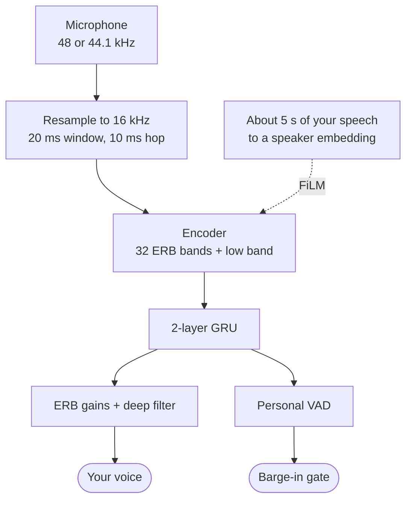

<p align="center">
  
</p>

<p align="center">
  <a href="https://github.com/arukh281/EarMark/actions/workflows/ci.yml"></a>
  <a href="LICENSE"></a>
  
  
</p>

**Earmark** gives voice agents ears that listen only to you. From about 5 seconds of your
speech, a small causal model isolates your voice from everything else in the room and tells
the agent, every 10 ms, whether *you* are speaking. It is built to run on-device, in the
browser.

## The problem

Voice agents stop talking the moment they hear speech, even when it isn't you. A TV, a
colleague nearby, or the agent's own voice leaking back from the laptop speaker all trigger
false "barge-ins", and the agent cuts itself off mid-sentence. Noise suppression can't fix
this, because every one of those sounds is real speech.

## What Earmark does

| Capability | What it means for you |
| --- | --- |
| **Isolates your voice** | Removes noise, other talkers and the agent's own echo, so the speech recogniser hears only you. |
| **Gates barge-in** | Emits a "you are speaking" signal every 10 ms, so the agent stops for you and nobody else. |
| **Stays on your device** | Designed to run locally in the page, so your audio doesn't need to leave your machine. |

One set of weights serves three modes: **Personal** (isolate your voice and gate barge-in),
**Gate** (keep the raw audio, gate barge-in only) and **Denoise** (no enrolment).

## First results: the week-1 pilot

A **2-hour pilot** of the main model, scored on 1,500 synthetic dev mixtures through the same
streaming path the engine will run. It proves the pipeline works end to end; it is not the
final model. The full training run is in progress, and the test set stays untouched until
every threshold is frozen on dev.

| What it measures | Pilot result (95% CI) | Week-1 bar |
| --- | --- | --- |
| How much cleaner your voice gets (SI-SDR improvement) | **+5.17 dB** (4.92 to 5.41) | interval above 0 dB: passed |
| How well it tells when you are speaking (VAD AUC) | **0.907** (0.899 to 0.916) | 0.90: passed |
| False barge-ins, while detecting 95% of your speech | **4.1 per minute** (3.6 to 4.6) | tracked |

Still weak: catching the *start* of your speech. The pilot catches 57% of speech onsets, a
median 220 ms late, and that is the main target for the full run.

Every number above is logged with its commit and inference path in
[`results/runs.jsonl`](results/runs.jsonl). Before anything was scored, the evaluation
harness was checked against published figures and reproduces them: on VoiceBank+DEMAND,
noisy input scores PESQ-WB 1.967 (published 1.97) and the official GTCRN checkpoint 2.868
(published 2.87).

## How it works



- **Causal and low-latency.** The model never looks at future audio: 20 ms of algorithmic
  latency and zero lookahead.
- **Enrolment.** A frozen WeSpeaker ResNet34-LM turns about 5 s of your speech into a
  256-dimensional speaker embedding.
- **Three model sizes, measured:**

  | Model | Parameters | Compute |
  | --- | --- | --- |
  | M (main) | 1.98M | 197 MMAC/s |
  | S-GRU | 0.29M | 30.5 MMAC/s |
  | S-SSM (S4D state-space) | 0.26M | 31.1 MMAC/s |

- **Engine.** A dependency-free C++17 streaming engine behind a small C API, compiled to
  WebAssembly in CI. It already runs the full signal path (resampling, STFT, ERB features
  and synthesis), matches the Python goldens, and allocates no memory after start-up.
  **Wiring the network in is this week's work;** until then it passes audio through
  unchanged and reports no speech.
- **One signal contract.** `contract/signal.yaml` generates the constants for Python, C++ and
  JavaScript, so the three implementations cannot drift apart.

## Training data

Mixtures are generated on the fly from public speech (LibriTTS-R), noise, real and simulated
room responses, and music. A synthetic agent voice (Kokoro TTS) is mixed in as an interferer,
because an agent hearing itself is one of the main causes of false barge-ins. Evaluation
speakers and voices never appear in training, and the mixer refuses to start if they do.
Every source and its licence is listed in [docs/DATA_AND_LICENSES.md](docs/DATA_AND_LICENSES.md).

## How it will be judged

- **Real rooms, not only synthetic mixes:** LibriCSS meeting-room recordings, plus a
  laptop-microphone set recorded with volunteers' consent ([consent form](docs/CONSENT_TEMPLATE.md))
  and released.
- **Baselines:** DeepFilterNet3 followed by a speaker-verification gate, and a raw personal gate.
- **Metrics:** false barge-ins per minute and onset delay; PESQ-WB, ESTOI and SI-SDR
  improvement; Whisper word error rate; end-to-end latency measured with an acoustic loopback.
- **No peeking:** every threshold is frozen on dev before any test run, and every scored run
  is logged with its commit and inference path.

## Roadmap

- [x] **Week 1:** signal contract, data pipeline, three models, trainer, engine skeleton, evaluation harness and CI
- [x] The pilot model passes the week-1 dev check
- [ ] **Week 2:** full model training *(running now)*, the network wired into the engine, and the in-browser demo
- [ ] **Week 3:** evaluation on real room recordings
- [ ] **Week 4:** release with a results table, a model card and a Hugging Face Space demo

<details>
<summary><b>Development</b></summary>

Local tooling:
- Python 3.12 in a uv-managed `.venv`, with `cmake` and `ninja` inside it;
- a C++17 compiler;
- Node 22 for the JavaScript checks.

WebAssembly is built only in GitHub Actions.

```sh
source scripts/env.sh     # keep HF, torch, uv, pip, npm and Playwright caches in ./.cache
make disk-guard           # fails when less than 5 GiB is free; run it before big downloads

make test                 # CPU unit tests (about 550, under 20 s); slow and gate tests excluded
make gates                # fetch + verify VoiceBank+DEMAND and GTCRN, then the Suite B gates
make contract-check       # fail if the generated constants are stale (make codegen rewrites them)
make goldens-check        # fail if the engine goldens are stale (make goldens rewrites them)
make engine               # configure (Ninja), build and ctest the C++ engine
make engine-sanitize      # the same under ASan + UBSan (Linux; on macOS pass SANITIZERS=-DEARMARK_UBSAN=ON)
make eval-dev EVAL_ARGS="--config M --checkpoint CKPT --manifest DEV/manifest.parquet --embeddings EMB.npz --check"
                          # score Earmark-Synth dev with the PyTorch-stream runner
make clean-caches         # delete ./.cache downloads and Python caches
make help                 # every target
```

**CI** (`.github/workflows/ci.yml`, ubuntu-24.04, Python 3.12) runs:
- the contract check;
- the Python CPU tests, with CPU-only torch and ffmpeg for the Opus tests;
- the engine's Catch2 tests, under clang ASan + UBSan and as a GCC release build;
- the Emscripten build, uploaded as the `earmark-wasm` artefact and smoke-tested in Node;
- on `main` only, the Suite B gates.

Test rules:
- Tests never download datasets and never need a GPU.
- Mark anything slower than about a minute with `@pytest.mark.slow`.
- Mark anything that needs fetched evaluation data with `@pytest.mark.gate`.
- Tokens (for example `HF_TOKEN`) come only from environment variables or from Kaggle and
  Colab Secrets.

</details>

<details>
<summary><b>Repository layout</b></summary>

- `contract/`: `signal.yaml`, the single source of every signal constant, and `codegen.py`,
  which generates `python/earmark/constants.py`, `engine/include/earmark_constants.h` and
  `web/src/constants.js`. See [docs/CONTRACT.md](docs/CONTRACT.md).
- `python/earmark/`: the `data`, `model`, `train`, `export` and `eval` packages.
- `engine/`: the C++17 streaming engine, its Catch2 tests and the WASM build. See
  [engine/README.md](engine/README.md). Every engine file was agent-written in week 1; the
  core parts are marked for line-by-line review by the author.
- `notebooks/`: jupytext `.py` notebooks for Kaggle and Colab, in run order (see
  [notebooks/README.md](notebooks/README.md)).
- `web/`: the browser app. For now it holds only the generated constants.
- `tests/`: CPU-only, offline pytest suites, one folder per package.
- `results/`: suite JSON, latency JSON and `runs.jsonl`.
- `docs/`:
  - [WEEK1_STATUS.md](docs/WEEK1_STATUS.md);
  - [CONTRACT.md](docs/CONTRACT.md);
  - [DATA_AND_LICENSES.md](docs/DATA_AND_LICENSES.md);
  - [DECISIONS.md](docs/DECISIONS.md);
  - [FAILURES.md](docs/FAILURES.md);
  - [CONSENT_TEMPLATE.md](docs/CONSENT_TEMPLATE.md).

</details>

## Licence

MIT, copyright 2026 Aradhya Khandelwal. See [LICENSE](LICENSE).

Third-party code:
- pocketfft (BSD-3-Clause, see `engine/third_party/POCKETFFT_LICENSE.md`);
- the GTCRN baseline model code (MIT, see `python/earmark/eval/baselines/GTCRN_LICENSE.txt`);
- Catch2, for the tests (Boost Software License 1.0).

Datasets and pretrained models are used under their own licences and are not redistributed
here. See [docs/DATA_AND_LICENSES.md](docs/DATA_AND_LICENSES.md).
